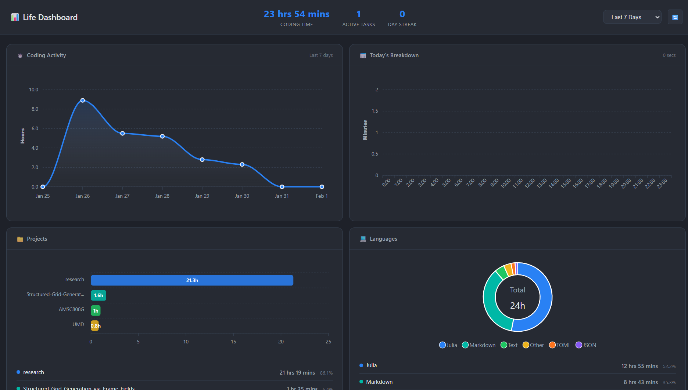

# Life Dashboard

A personal productivity dashboard with a WakaTime-inspired dark theme.

## Features

- **Coding Stats** - WakaTime integration (time by project, language, editor)
- **Music** - Last.fm now playing and top artists
- **Todos** - Task management with hierarchy
- **Notes** - Quick notes with pagination
- **Journal** - Daily entries with mood tracking

## Quick Start

```bash
# 1. Configure environment
cp config/.env.example docker/.env
# Edit docker/.env with your API keys

# 2. Run with Docker
docker-compose -f docker/docker-compose.yml up -d

# 3. Open http://localhost:8081
```

## Get API Keys

- **WakaTime**: https://wakatime.com/settings/api-key
- **Last.fm**: https://www.last.fm/api/account/create

## Local Development

```bash
pip install -r backend/requirements.txt
cd backend && uvicorn app:app --port 8081 --reload
```

## Project Structure

```
life-dashboard/
├── backend/
│   ├── api/                  # External API clients
│   │   ├── lastfm.py         # Last.fm integration
│   │   ├── wakatime.py       # WakaTime integration
│   │   ├── activitywatch.py  # ActivityWatch integration
│   │   └── quotes.py         # Quotes API
│   ├── database/
│   │   ├── models.py         # SQLAlchemy models
│   │   ├── schemas.py        # Pydantic schemas
│   │   └── crud.py           # Database operations
│   ├── routes/
│   │   ├── dashboard.py      # Main dashboard routes
│   │   ├── todos.py          # Todo CRUD
│   │   ├── notes.py          # Notes CRUD
│   │   └── journal.py        # Journal CRUD
│   ├── services/
│   │   └── cache.py          # API response caching
│   ├── app.py                # FastAPI application
│   ├── config.py             # Environment config
│   └── requirements.txt
├── frontend/
│   ├── static/
│   │   ├── css/styles.css    # Dark theme styles
│   │   └── js/
│   │       ├── app.js        # Main application logic
│   │       └── charts.js     # ApexCharts config
│   └── templates/
│       ├── base.html         # Base layout
│       └── dashboard.html    # Main dashboard
├── docker/
│   ├── Dockerfile
│   └── docker-compose.yml
├── config/
│   └── .env.example          # Environment template
├── scripts/
│   └── migrate_markdown.py   # Data migration script
└── data/                     # SQLite database (gitignored)
```

## Example



## Tech Stack

Python/FastAPI, SQLite, ApexCharts, Docker

## To Do
### APIs
- [ ] Garmin
- [ ] Youtube
- [ ] Monkeytype
- [ ] Beeper
- [ ] Toggl

### Ideas
- [ ] Send notifications to myself using beeper api 
- [ ] find a way to track my phone usage
- [ ] create a way to log current irl activity via phone
- [ ] get activity watch working